# 🎨 Workflow Figma → Frontend - Reboul Store

**Version** : 1.0  
**Date** : 10 décembre 2025  
**Outil** : Figma (compte complet 20€/mois)

Voir aussi : [[../context/ROADMAP_COMPLETE.md|ROADMAP_COMPLETE]] - [[../../frontend/FRONTEND.md|FRONTEND]] - [[../animations/ANIMATIONS_GUIDE.md|ANIMATIONS_GUIDE]]

---

## 🎯 Philosophie

**Design d'abord, code ensuite** : On crée une maquette Figma claire avant d'écrire une ligne de code.

### Avantages

✅ **Vision claire** : On sait exactement ce qu'on code  
✅ **Gain de temps** : Moins d'aller-retours et d'itérations en code  
✅ **Qualité** : Design cohérent et professionnel  
✅ **Validation rapide** : On peut valider avec l'équipe avant de coder  
✅ **Documentation visuelle** : Figma = référence pour tout le projet  

---

## 📋 Quand utiliser Figma ?

### ✅ TOUJOURS pour :

- **Nouvelles pages complètes** : Login, Register, Profile, Checkout, Dashboard Admin, etc.
- **Composants UI complexes** : Formulaires multi-étapes, modales custom, cartes produits spéciales
- **Nouveaux layouts** : Refonte Header, nouvelle section Home, grille custom
- **Modifications importantes** : Changement de style majeur, nouvelle feature UI

### ❌ PAS nécessaire pour :

- Corrections mineures (changer une couleur, ajuster un padding)
- Composants shadcn/ui standards (déjà designés)
- Fix bugs techniques (pas de changement visuel)
- Optimisations de performance

---

## 🔄 Workflow Complet (4 Phases)

### 📐 **PHASE 1 : Design dans Figma** (TOI)

#### 1.1 Préparation

**Avant de commencer :**
- ✅ Consulter ROADMAP_COMPLETE.md : Quelle page/composant est à faire maintenant ?
- ✅ Lire les spécifications : Quelles fonctionnalités doit avoir cette page ?
- ✅ Regarder l'existant : Y a-t-il des composants similaires déjà créés ?

**Ouvrir Figma :**
- Créer ou ouvrir le fichier "Reboul Store - [Nom de la phase]"
- Créer une nouvelle frame pour ta page (ex: "Login Page")

#### 1.2 Design System à respecter

**Style général** : A-COLD-WALL* (minimaliste, premium, épuré)

| Élément | Valeur |
|---------|--------|
| **Typo** | Geist (principal), Geist Mono (code/technique) |
| **Couleurs** | Palette Reboul : Noir (#000000), Blanc (#FFFFFF), Gris (#F5F5F5, #E5E5E5, #A3A3A3), Accent (à définir) |
| **Espacements** | Multiples de 4px (4, 8, 12, 16, 24, 32, 48, 64, 96) |
| **Coins arrondis** | 0px (carré), 4px (léger), 8px (moyen), 16px (prononcé) |
| **Ombres** | Subtiles, style minimaliste |
| **Composants** | Base shadcn/ui (Button, Input, Card, etc.) |

#### 1.3 Créer le design

**Étapes :**

1. **Structure (Auto Layout)** :
   - Utiliser Auto Layout pour tous les containers (≈ Flexbox)
   - Définir direction (horizontal/vertical), gap, padding
   - Penser mobile-first (design mobile d'abord)

2. **Composants** :
   - Utiliser/créer des composants réutilisables
   - Nommer clairement : `Button/Primary`, `Form/Input`, `Card/Product`
   - Créer des variants pour les états (default, hover, active, disabled, error)

3. **Contenu** :
   - Utiliser du contenu réaliste (pas de "Lorem ipsum" si possible)
   - Images : Utiliser des placeholders ou vraies images Reboul

4. **Responsive** :
   - Créer les 3 breakpoints : Mobile (375px), Tablet (768px), Desktop (1440px)
   - Vérifier que le design s'adapte bien

5. **États & Interactions** :
   - Designer les états : hover, active, focus, disabled, error, loading
   - Ajouter des annotations pour les interactions complexes

#### 1.4 Vérification avant partage

**Checklist :**
- [ ] Auto Layout utilisé partout (facilite compréhension structure)
- [ ] Composants nommés clairement
- [ ] États importants designés (hover, error, disabled)
- [ ] Design cohérent avec l'existant (couleurs, typo, espacements)
- [ ] Responsive vérifié (mobile, tablet, desktop)
- [ ] Annotations ajoutées si interactions complexes

#### 1.5 Partage

**Comment partager :**
1. Cliquer sur "Share" (en haut à droite)
2. Copier le lien de partage
3. Vérifier les permissions (au moins "can view")
4. Me partager le lien avec un message clair :
   ```
   Voici le design de la page [NOM] :
   [LIEN FIGMA]
   
   Points importants :
   - [Interaction 1]
   - [Comportement 2]
   - [État spécial 3]
   ```

---

### 💻 **PHASE 2 : Implémentation Code** (MOI ou TOI selon mode)

#### 2.1 Consultation Figma

**Ce que je fais :**
1. J'ouvre ton lien Figma
2. J'analyse le design :
   - Structure globale (layout, sections)
   - Composants utilisés (identifier équivalents shadcn/ui)
   - Mesures (padding, margin, gaps, tailles)
   - Couleurs (codes hex)
   - Typographie (tailles, poids)
   - États (hover, focus, etc.)
3. Je planifie l'implémentation :
   - Quels composants shadcn/ui utiliser ?
   - Structure de fichiers (pages, composants)
   - Props nécessaires
   - State management (useState, useAuth, etc.)
   - Appels API

#### 2.2 Implémentation

**Deux modes possibles :**

**A. Mode Pédagogique (par défaut)** :
1. Je te donne le code à écrire avec explications
2. Tu codes toi-même
3. Je vérifie ton code
4. On corrige ensemble jusqu'à ce que ça marche

**B. Mode Normal (si tu demandes explicitement)** :
1. Je code directement en me basant sur Figma
2. J'utilise shadcn/ui + TailwindCSS
3. Je respecte ton design (couleurs, espacements, typo)
4. Je structure proprement (composants réutilisables)
5. J'ajoute la logique métier (hooks, API, state)

#### 2.3 ⚠️ IMPORTANT - Ne PAS utiliser l'export Figma

**❌ À NE PAS FAIRE :**
- Copier-coller l'export Figma tel quel
- Utiliser le code généré par plugins d'export directement

**✅ À FAIRE :**
- Utiliser Figma comme **référence visuelle**
- Recoder proprement avec notre stack (React + shadcn + Tailwind)
- L'export peut donner des idées de structure, mais à **adapter**

**Pourquoi ?**
- Export Figma = code "sale" (div inutiles, styles inline, pas de logique)
- Pas de composants réutilisables
- Pas de hooks, pas d'API, pas de state
- Pas optimisé, pas maintenable

**Le bon workflow :**
```
Figma (référence visuelle) → Je code proprement → Résultat identique au design
```

---

### ✅ **PHASE 3 : Validation & Ajustements** (ENSEMBLE)

#### 3.1 Tests

**Checklist de vérification :**

1. **Visuel** :
   - [ ] Le rendu correspond au design Figma
   - [ ] Couleurs exactes (vérifier codes hex)
   - [ ] Typographie correcte (tailles, poids)
   - [ ] Espacements respectés (padding, margin, gaps)
   - [ ] Alignements corrects

2. **Responsive** :
   - [ ] Mobile (375px) : Layout adapté, texte lisible
   - [ ] Tablet (768px) : Bon usage de l'espace
   - [ ] Desktop (1440px+) : Design optimal

3. **Interactions** :
   - [ ] Hover : Effets visuels corrects
   - [ ] Focus : États de focus visibles (accessibilité)
   - [ ] Active : Feedback visuel lors du clic
   - [ ] Disabled : États désactivés corrects
   - [ ] Error : Messages d'erreur affichés correctement

4. **Fonctionnel** :
   - [ ] Formulaires : Validation fonctionne
   - [ ] Boutons : Actions déclenchées correctement
   - [ ] Navigation : Liens/routes fonctionnent
   - [ ] API : Appels backend OK, gestion erreurs

#### 3.2 Comparaison Figma ↔ Code

**Processus :**
1. Ouvrir Figma et le site côte à côte
2. Comparer visuellement chaque élément
3. Noter les différences
4. Décider : ajuster code OU ajuster Figma ?

#### 3.3 Ajustements

**Si différences :**

**Option A : Ajuster le code**
- Si Figma est correct, on modifie le code
- Cas : mauvaise interprétation, erreur de mesure

**Option B : Ajuster Figma**
- Si le design Figma n'est pas optimal en pratique
- Cas : contraintes techniques, meilleure UX découverte

**On itère jusqu'à satisfaction complète** ✅

---

### 📝 **PHASE 4 : Documentation** (MOI)

#### Après implémentation réussie

**Fichiers à mettre à jour :**

1. **ROADMAP_COMPLETE.md** ✅
   - Cocher `[x]` la tâche correspondante
   - Exemple : `- [x] Page Login (formulaire connexion)`

2. **CONTEXT.md** ✅
   - Si fin de phase : mettre à jour version et "État actuel"
   - Ajouter la nouvelle page/composant dans la section Frontend

3. **frontend/FRONTEND.md** ✅
   - Ajouter la nouvelle page dans la section "Pages"
   - Ajouter les nouveaux composants dans la section "Composants"
   - Documenter les props, hooks utilisés

4. **API_CONFIG.md** (si nouveaux endpoints)
   - Documenter les nouveaux endpoints utilisés
   - Mettre à jour l'historique

#### Captures d'écran (optionnel)

- Capturer screenshot de la page finale
- Stocker dans `assets/screenshots/`
- Utile pour documentation et portfolio

---

## 🔌 Plugins Figma Recommandés

### Essentiels

| Plugin | Utilité | Quand l'utiliser |
|--------|---------|------------------|
| **Iconify** | Bibliothèque d'icônes (Lucide, Heroicons) | Pour ajouter des icônes |
| **Unsplash** | Photos gratuites haute qualité | Pour images placeholder |
| **Lorem Ipsum** | Générateur de texte | Pour contenu temporaire |
| **A11y - Color Contrast Checker** | Vérifier contraste (accessibilité) | Avant de valider design |

### Utiles

| Plugin | Utilité | Quand l'utiliser |
|--------|---------|------------------|
| **Tailwind CSS** | Générer classes Tailwind | Pour référence lors du code |
| **Anima** | Export React/HTML/CSS | Pour inspiration structure (pas production) |
| **Figma to Code** | Export React/Vue | Pour inspiration structure (pas production) |
| **Content Reel** | Générer contenu réaliste | Pour remplir designs |

### ⚠️ Note sur les plugins d'export

Les plugins comme Anima ou Figma to Code sont **utiles pour l'inspiration**, mais :
- ❌ Ne jamais utiliser l'export tel quel en production
- ✅ Utiliser pour comprendre la structure
- ✅ Recoder proprement ensuite

---

## 📚 Bonnes Pratiques Figma

### ✅ À FAIRE

| Pratique | Pourquoi | Impact |
|----------|----------|--------|
| **Nommer clairement les layers** | Facilite compréhension | Je comprends vite la structure |
| **Utiliser Auto Layout partout** | ≈ Flexbox, facile à traduire en code | Code plus rapide et fidèle |
| **Créer des composants réutilisables** | Design system cohérent | Réutilisabilité dans le code |
| **Utiliser variables de couleurs** | Cohérence palette | Facile de changer couleurs |
| **Designer mobile-first** | Comme notre code | Responsive naturel |
| **Définir tous les états** | Prévoir tous les cas | Moins de questions |
| **Ajouter annotations** | Clarifier interactions complexes | Implémentation correcte |

### ❌ À ÉVITER

| Pratique | Pourquoi | Impact |
|----------|----------|--------|
| **Designs trop complexes** | Difficile/impossible à coder | Frustration, perte de temps |
| **Positions absolues partout** | Pas responsive | Difficile à implémenter |
| **Trop d'effets custom** | Performance, complexité | Code lourd, lent |
| **Oublier les états** | Incomplet | Beaucoup de questions après |
| **Contenu "Lorem ipsum"** | Pas réaliste | Problèmes de layout réels |
| **Layers mal nommés** | Confusion | Difficulté à comprendre |

---

## 🎯 Exemples Concrets

### Exemple 1 : Page Login

**Phase 1 : Design (TOI)**
```
Tu designs dans Figma :
- Frame "Login Page" (375px mobile-first)
- Header avec logo Reboul
- Formulaire : Email (input), Password (input), Forgot password (link)
- Bouton "Se connecter" (primary)
- Lien "Créer un compte" (vers /register)
- Footer minimaliste

Tu partages : "Voici la page Login : [lien Figma]"
```

**Phase 2 : Code (MOI)**
```
Je regarde Figma et je code :
- Composant Login.tsx
- Utilise shadcn/ui : Input, Button, Label
- Hook useAuth() pour login()
- Validation formulaire avec react-hook-form
- Gestion erreurs (email invalide, mauvais password)
- Redirection après login réussi
```

**Phase 3 : Validation (ENSEMBLE)**
```
Tu testes :
- Visuel OK ? ✅
- Responsive OK ? ✅
- Login fonctionne ? ✅
- Erreurs affichées ? ✅

Si OK → Phase 4
Si pas OK → On ajuste
```

**Phase 4 : Documentation (MOI)**
```
Je mets à jour :
- ROADMAP_COMPLETE.md : [x] Page /login
- FRONTEND.md : Ajouter Login dans pages
- CONTEXT.md : Phase 10.2 avancée
```

### Exemple 2 : Dashboard Admin

**Phase 1 : Design (TOI)**
```
Tu designs dans Figma :
- Sidebar navigation (Home, Produits, Commandes, Clients)
- Header top (search, notifications, profile)
- Content area : Cards statistiques (ventes, commandes, clients)
- Table produits récents
- Responsive : sidebar collapse sur mobile

Tu partages : "Voici le Dashboard Admin : [lien Figma]
Note : Sidebar collapse en hamburger sur mobile"
```

**Phase 2 : Code (MOI)**
```
Je code :
- Layout DashboardLayout.tsx (sidebar + header + content)
- Composants : Sidebar, Header, StatsCard, DataTable
- Utilise shadcn/ui : Card, Table, Button, Avatar
- State : useSidebar() pour collapse mobile
- API : useStats() pour récupérer données
```

**Phase 3 : Validation (ENSEMBLE)**
```
Tests :
- Sidebar collapse mobile ? ✅
- Stats chargées ? ✅
- Table triable ? ✅
- Navigation fonctionne ? ✅
```

---

## 🎉 Retour d'Expérience : Premier Succès (Login Page)

### 📅 Date : 10 décembre 2025

### 🎯 Contexte

Premier test du workflow Figma → Code sur la page **Login**.

**Problème initial :**
- Code existant basique ne correspondait pas au design souhaité
- Besoin d'un design pixel-perfect A-COLD-WALL* (minimaliste, premium)

### 🔧 Ce qu'on a fait

#### 1. Import dans Figma (Plugin "HTML to Design")
```
Étape 1 : Code existant → Importé dans Figma
Étape 2 : Design amélioré dans Figma (layout 2 colonnes, vidéo, typographie exacte)
Étape 3 : Export du design pour référence
```

#### 2. Codage précis avec `get_design_context`
```typescript
// Utilisation du plugin Figma dans Cursor
get_design_context({ nodeId: "1:19" })
  → Récupère code exact généré par Figma
  → Classes Tailwind précises (gap-[1.5px], leading-[0], etc.)
  → Structure HTML avec positions absolues
```

#### 3. Adaptation au projet React
```typescript
// On transforme le code Figma (brut) en composant React propre
- Remplacement des divs statiques par <input>, <button>, <Link>
- Ajout de la logique (useState, handleSubmit, etc.)
- Conservation des styles EXACTS de Figma
```

### ✅ Résultats

**Réussite complète !** 

#### 🎨 Design
- ✅ Reproduction **pixel-perfect** du design Figma
- ✅ Typographie exacte (`font-[Geist]`, `leading-[20px]`, `tracking-[-0.6px]`)
- ✅ Espacements précis (`gap-[1.5px]`, `top-[71px]`, `mb-[71px]`)
- ✅ Couleurs exactes (`#4a5565`, `#6a7282`, `rgba(0,0,0,0.5)`)
- ✅ Layout 2 colonnes (formulaire + vidéo background)
- ✅ Logo overlay avec `mix-blend-luminosity` et `opacity-[0.81]`

#### 📱 Responsive
- ✅ Mobile (< 768px) : Formulaire centré, vidéo masquée
- ✅ Tablet (768px - 1024px) : Layout 2 colonnes, logo centré
- ✅ Desktop (> 1024px) : Design Figma exact, logo positionné fixe

#### 🛠️ Technique
- ✅ Composant React fonctionnel (pas juste du HTML statique)
- ✅ Logique authentification intégrée (`useAuth`, `handleSubmit`)
- ✅ Navigation intelligente (redirection après login)
- ✅ Gestion d'erreurs
- ✅ Accessibilité (labels, autocomplete, focus)

### 🔑 Clés du Succès

#### 1. **Utiliser `get_design_context` (Figma Plugin Cursor)**
```typescript
// NE PAS se contenter de regarder Figma
// RÉCUPÉRER le code exact avec le plugin Cursor
get_design_context({ nodeId: "1:19" })
```
→ Donne les valeurs EXACTES (pas d'approximation)

#### 2. **Copier TOUT, pas seulement les nouveautés**
```
❌ Erreur : "J'ajoute la vidéo mais je garde le formulaire existant"
✅ Correct : "Je recrée TOUT le formulaire avec les valeurs Figma exactes"
```

#### 3. **Adapter intelligemment au projet**
```typescript
// Code Figma (brut)
<div className="bg-white border border-black h-[48px]">
  <div className="text-[14px]">votre@email.com</div>
</div>

// Code React adapté (propre)
<input
  type="email"
  className="bg-white border border-black h-[48px] text-[14px] px-3"
  placeholder="votre@email.com"
/>
```

#### 4. **Responsive intelligent**
```typescript
// Desktop : positions absolues (comme Figma)
className="absolute top-[576px] left-[-1px]"

// Mobile : flow normal relatif
className="flex flex-col mt-8 items-center"

// Utiliser md: breakpoint intelligemment
className="text-[28px] md:text-[36px] text-center md:text-left"
```

### 📝 Leçons Apprises (VERSION FINALE - 10 déc 2025)

#### ✅ À FAIRE (Best Practices validées)

1. **Utiliser `get_design_context` TOUJOURS**
   ```typescript
   get_design_context({ nodeId: "1:19" })
   // Récupère les valeurs EXACTES (pas d'approximation)
   ```

2. **Analyser AVANT de coder**
   - Regarder la structure Figma (container, colonnes, éléments)
   - Identifier les positions absolues vs relative
   - Planifier la conversion en React propre
   - Penser responsive DÈS LE DÉBUT

3. **Reproduire TOUTES les valeurs Figma**
   - Espacements : `mb-[71px]`, `gap-[1.5px]`, `gap-6`
   - Typographie : `leading-[20px]`, `tracking-[-0.6px]`, `text-[14px]`
   - Couleurs : `#4a5565`, `#6a7282`, `rgba(0,0,0,0.5)`
   - Dimensions : `h-12`, `w-[478px]`, `rounded-[2px]`

4. **Convertir intelligemment (Absolute → Relative)**
   ```typescript
   // Figma (positions absolues)
   <div className="absolute top-[71px] left-0 right-0">
   
   // React propre (relative avec mêmes espacements)
   <div className="space-y-[71px]">  // Garde la valeur exacte !
   ```

5. **Faire du beau code React**
   - Minimum de divs
   - HTML sémantique (`<header>`, `<form>`, `<label>`, `<input>`)
   - Utiliser `space-y-*` au lieu de divs wrapper
   - Composants fonctionnels propres

6. **Responsive intelligent DÈS LE DÉBUT**
   ```typescript
   // Grid avec largeurs fixes (comme Figma)
   className="grid-cols-1 lg:grid-cols-[478px_1fr]"
   
   // Pas grid-cols-2 (50%/50%) qui crée des espaces
   ```

7. **Respecter les valeurs Figma en responsive**
   - Mobile : Mêmes espacements (mb-[71px] reste mb-[71px])
   - Desktop : Mêmes espacements (pas de changement)
   - Seul le layout change (vertical → horizontal)

8. **Gap et paddings précis**
   ```typescript
   // Figma indique les gaps exacts
   lg:gap-[10px]  // Entre colonnes
   pb-[15px] pl-4 pr-[9px] pt-[10px]  // Sur container principal
   ```

#### ❌ À ÉVITER (Erreurs courantes)

1. ❌ **Se contenter de regarder Figma** → Toujours `get_design_context`

2. ❌ **Approximer les valeurs** → `leading-[20px]` pas `leading-5`

3. ❌ **Changer les espacements en responsive**
   ```typescript
   ❌ mb-12 lg:mb-[71px]  // Change l'espacement mobile
   ✅ mb-[71px]           // Garde toujours la même valeur
   ```

4. ❌ **Grid 50%/50% au lieu de largeurs fixes**
   ```typescript
   ❌ grid-cols-2              // 50%/50% → crée des espaces
   ✅ grid-cols-[478px_1fr]   // Largeurs Figma exactes
   ```

5. ❌ **Trop de divs inutiles** → Structure HTML propre

6. ❌ **Oublier le padding du container principal**
   - Les paddings sont sur le container, pas sur les colonnes

7. ❌ **Coder sans réfléchir** → Analyser d'abord, coder ensuite

8. ❌ **Centrer en desktop quand Figma aligne à gauche**
   ```typescript
   ❌ justify-center            // Centre le formulaire
   ✅ lg:justify-start          // Aligne à gauche (Figma)
   ```

### 🚀 Workflow Final Validé (VERSION FINALE)

```mermaid
graph LR
    A[Besoin / Code existant] --> B[Import dans Figma]
    B --> C[Design dans Figma]
    C --> D[get_design_context + get_screenshot]
    D --> E[ANALYSER structure Figma]
    E --> F[Planifier conversion Absolute → Relative]
    F --> G[Coder React propre - valeurs EXACTES]
    G --> H[Responsive DÈS LE DÉBUT]
    H --> I[Test Desktop + Mobile]
    I --> J[Ajustements précis - gap - padding]
    J --> K[Validation finale]
    K --> L[Documentation]
```



#### Étapes détaillées :

1. **get_design_context + get_screenshot** : Récupérer code ET visuel
2. **ANALYSER** : Structure, positions, espacements, largeurs
3. **PLANIFIER** : Comment convertir absolute → relative
4. **CODER** : React propre, valeurs exactes, HTML sémantique
5. **RESPONSIVE** : Dès le début (grid, largeurs fixes, alignements)
6. **AJUSTER** : Gaps, paddings, alignements précis
7. **VALIDER** : Comparer avec Figma screenshot
8. **DOCUMENTER** : Leçons apprises

### 📊 Temps Investi (VERSION FINALE)

- **Design Figma** : ~45 min (import HTML to Design + ajustements)
- **Codage premier essai** : ~15 min (incomplet - erreurs)
- **Codage pixel-perfect (2e essai)** : ~20 min (avec `get_design_context`)
- **Responsive (3e essai)** : ~15 min (erreurs de centrage)
- **Ajustements finaux** : ~25 min (grid largeurs fixes, gaps, paddings)
- **Documentation complète** : ~20 min

**Total** : ~2h20 pour une page Login complète pixel-perfect responsive documentée

**Leçon** : Analyser AVANT de coder = gain de temps (1ère fois prend plus longtemps, mais on apprend)

### 🎓 Pour la Suite

**Ce workflow est validé !** On l'applique maintenant à :
- ✅ Page Register (Phase 10.2)
- ⏳ Page Profile (Phase 10.3)
- ⏳ Toutes les pages Phases 10-14

**Fichier de référence** : `frontend/src/pages/Login.tsx` (exemple parfait)

---

## 📞 Questions Fréquentes

### Q1 : Dois-je designer CHAQUE page avant de coder ?

**R :** Oui pour les nouvelles pages/composants complexes. Non pour les ajustements mineurs.

### Q2 : Et si je n'ai pas d'idée de design ?

**R :** 
1. Regarde Figma Community : cherche "e-commerce login", "checkout page", etc.
2. Regarde les sites similaires (A-COLD-WALL*, autres concept stores)
3. On en discute ensemble, je te guide

### Q3 : Dois-je designer mobile ET desktop ?

**R :** **Oui**, au minimum mobile (375px) et desktop (1440px). Tablet (768px) si le layout change beaucoup.

### Q4 : Combien de temps pour designer une page ?

**R :** 
- Page simple (Login) : 30-60 min
- Page moyenne (Checkout) : 1-2h
- Page complexe (Dashboard Admin) : 2-4h

### Q5 : Dois-je utiliser l'export Figma ?

**R :** **Non** pour le code production. **Oui** pour l'inspiration structure. Toujours recoder proprement.

### Q6 : Comment partager mon design Figma ?

**R :** 
1. Cliquer "Share" en haut à droite
2. Copier le lien
3. Vérifier permissions (au moins "can view")
4. Me l'envoyer avec contexte

### Q7 : Et si mon design n'est pas codable ?

**R :** On en discute ! Souvent il y a une solution, ou on ajuste le design ensemble.

---

## 🚀 Checklist de démarrage

Avant de commencer ton premier design Figma :

- [ ] Compte Figma complet (20€/mois) créé
- [ ] Installer plugins recommandés (Iconify, Unsplash, A11y)
- [ ] Créer fichier "Reboul Store - Phases 10-12"
- [ ] Importer Design System Reboul (couleurs, typo Geist)
- [ ] Regarder tutoriel Auto Layout (10 min sur YouTube)
- [ ] Consulter ROADMAP_COMPLETE.md : Quelle page designer en premier ?

---

## 📖 Ressources

### Tutoriels Figma
- [Figma Basics (officiel)](https://www.youtube.com/watch?v=Cx2dkpBxst8)
- [Auto Layout Tutorial](https://www.youtube.com/watch?v=TyaGpGDFczw)
- [Figma for Developers](https://www.youtube.com/watch?v=HZuk6Wkx_Eg)

### Inspiration Design
- [Figma Community - E-commerce](https://www.figma.com/community/search?model_type=files&q=e-commerce)
- [A-COLD-WALL* (style référence)](https://www.a-cold-wall.com/)
- [Awwwards - Inspiration sites](https://www.awwwards.com/)

### Design System
- [shadcn/ui Components](https://ui.shadcn.com/)
- [Tailwind CSS Docs](https://tailwindcss.com/docs)

---

**🎨 Ce workflow est notre nouvelle norme pour tout le frontend ! Let's design beautiful things! 🚀**
